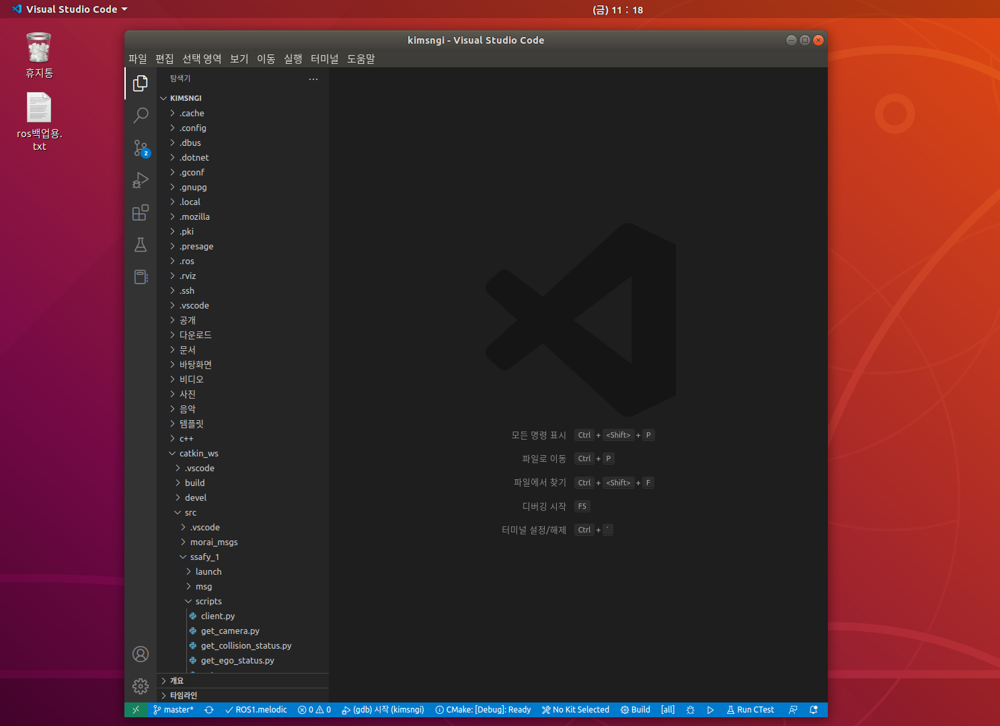
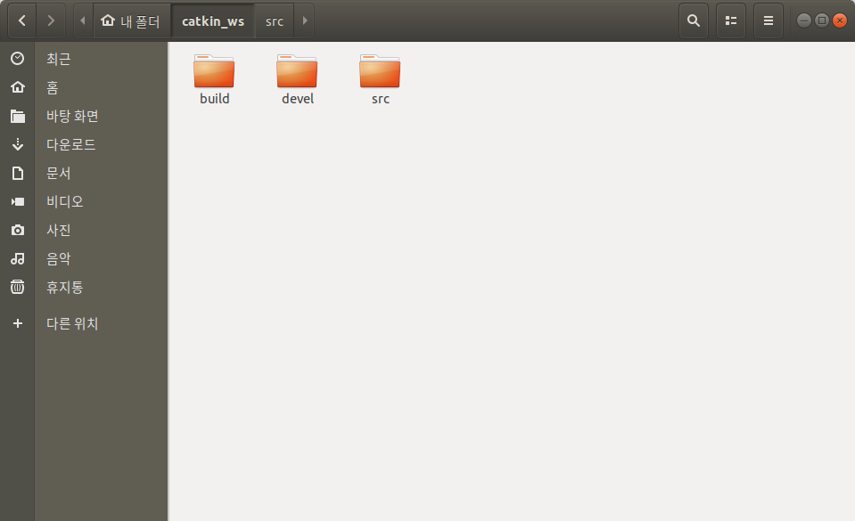
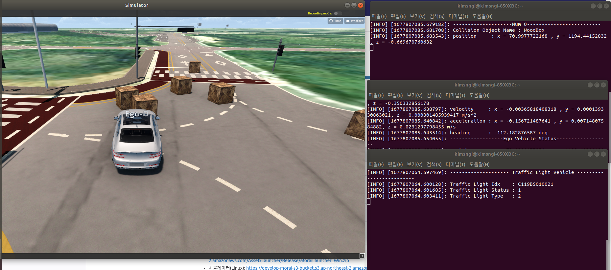
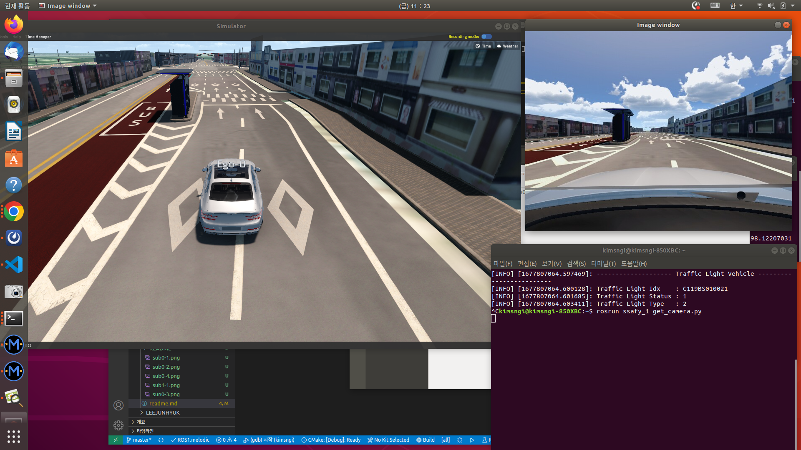

# SUB PJT 1 과제

## Req1 스켈레톤 프로젝트 개발환경 설정

- ubuntu 멀티부팅 환경 구축

- ROS 설치

- VS Code 설치

- workspace 만들기

## Req2 ROS 통신 프로토콜

- 차량의 출동정보 수신
- Ego 차량의 상태정보 수신
- 도로의 신호등 정보 수신

## Req3 시뮬레이터 센서 데이터 송수신

- 시뮬레이터에서 연결한 카메라 센서의 이미지 받아오기

