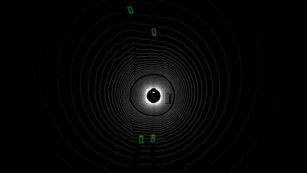
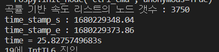
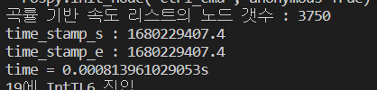
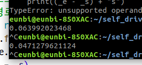

[ 삼성 청년 SW 아카데미 (SSAFY) 8기 - 2학기 특화프로젝트 ]

# ISDS

## I. 서비스 소개

### 개요

- **I**ntersection **S**afety **D**rive **S**ystem
  (교차로 안전 운전 시스템)
- **자율주행 환경**에서 교차로 내 **우회전** 시 **고도화된 상황대처 시스템**

### 타겟

- **우회전 시 발생하는 돌발 사고를 예방**하고 싶은 자율주행 차량 운전자
- 교차로 우회전 시 돌발상황 대처 능력이 상대적으로 부족한 **초보운전자**

## II. 기획 배경

### 배경

- **최근 수년간 우회전 교통사고 보행 사상자 수치는 유지 중**
- **앞으로 급격하게 성장 예정인 자율주행 차량 시장**
- **자율주행 차량의 우회전 상황에서의 고도화된 상황 대처 시스템이 필요**

### 목적

- **자율주행 시장의 성장성**, **줄어들지 않는 교차로 우회전 사고율**을 해결하기 위해 **ISDS** 시스템을 개발

### 의의

- 우회전 상황에서의 자율주행 차량의 상황 대처 능력 향상으로 사고율 감소

## III. 주요 기능

- 기본적인 자율주행 SW에 **ISDS** SW모듈이 탑재된 형태
- **ISDS**
  - 우회전 직전 정지선에서의 일시정지
  - 우회전 시 신호등 확인 후 진입
  - 우회전 시 보행자 감지 상황에서 일시정지
  - 우회전 시 좌측에 직진 차량 대처
  - 보행자의 급작스런 돌발행동 상황 대처 (갑자기 뛰어오는 어린이, 자전거 역주행, 무단횡단 등)

## IV. 기술

- **공통**
  - 개발언어 : Python 3.7
  - Framework : ROS melodic 1.0
  - Simulator : Morai Simulator
  - 개발 환경 : Ubuntu
- **인지**
  - LiDAR, Camera, GPS, IMU
  - open CV
  - Lane detection based Canny Edge & RANSAC Algorithm
  - PointPillars
  - Yolo-X
- **판단**
    - Dijkstra Algorithm
    - Acceleration by Curvature
    - Velocity Map Caching (with File System)
- **제어**
    - Pure-Pursuit Algorithm
    - PID control
    - ACC (Adaptive Cruise Control)

## VI. 협업 툴 및 협업 환경

- **Notion**
  - 기획 및 회의록 작성
  - 산출물 기록 및 공유
- **JIRA**
  - 매주 목표량 설정하여 sprint 진행
  - 업무 할당량 정하여 Story Point 설정, In Progress > Done 순으로 작성
- **GitLab**
  - 코드 버전 관리
  - 이슈 발행 및 관리

## VII. 역할 분담

- **인지**
  - 이준혁 :
    - mmdetection3d - Pointpillars모델을 이용한 3d object detection
    - Camrea Lidar Sensor Fusion
  - 차영후
    - 차선 인식 알고리즘 설계 및 개선
    - Yolo-X model 신호등 Dataset 학습 및 적용
    - 인지 파트 SW설계
    - 개발 및 최적화
- **판단 & 제어**
    - 김호준(팀장) :
        - Adaptive Cruise Control 전방 NPC 차량 인식 개선
        - 신호에 따른 행동 설계
    - 장지웅 :
        - 환경 설정 및 시각화를 이용한 정보 공유 효율화
        - 정지선 판단
        - 곡률 기반 속도 리스트 파일 매핑
    - 김승기 :
        - 종방향 제어(곡률 기반 제어 및 인지 데이터 기반 제어)
        - 신호에 따른 행동 설계 및 개발
    - 조은비 :
        - 횡방향 제어(PID 스티어링 적용)
        - Dijkstra 개선(우선순위 큐 적용)

## VIII. 프로젝트 결과물

- **인지**

  - **차선 인식 알고리즘을 개선**
    (기존 white-yellow color 검출 기반 ⇒ Canny Edge 기반)
  - **다양한 환경(악천후, 박명, 일몰, 야간 등)에서의 차선 검출 정확도 향상**

    (개선 전 대비 57% 향상 - Ground truth 데이터 기준으로 정확도 산출)

    

  - **Lidar 데이터를 이용한 3D Object Detection**
    
    
  - **ISDS개발**
    - ISDS 인지 파트 플로우 (설계)
      

- **판단**
    - **Mgeo, MatplotLib를 이용한 정지선 판단 시각화**

        

        
    
    - **횡단보도 시각화**

        
        
    - **정지선 판단 후 제어**
    
    
    
    - **곡률 기반 속도 리스트 파일 매핑**
        
        - 매핑 전
        
        
        
        - 매핑 후
        
        
        
    - **Dijkstra 개선**
        
        

- **제어**
   - **곡률에 따른 속도 제어** (가속, 감속 제어)
        - 좌/우회전 시 최대 속도 100km/h 부터 감속 비교
        
        
        
        
        
    - **인지 데이터 기반 제어**
        
        
        
    
    - **곡률 기반 속도 개선** ( 예견 거리 계획 → 곡률 반경 기반 주행 목표점 계획, 곡률 기반 목표 속도 계획 )
    
        
