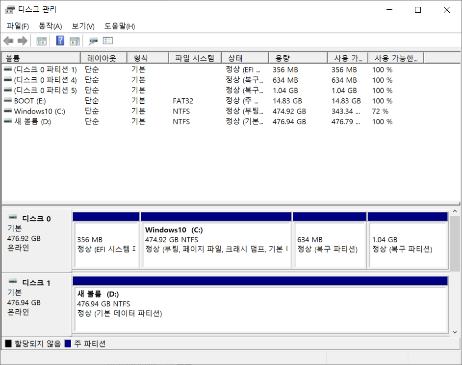

# 환경설정

# 리눅스OS 설치(멀티OS)

### 하드 디스크 파티션 만들기 및 포맷

- `시작 매뉴` → `하드 디스크 파티션 만들기 및 포맷` 실행
    
    
    
- ‘디스크 1’ 우클릭 → `속성` → `볼륨` → ‘파티션 형식’ 확인
    - GUID 파티션 테이블(GPT)
- ‘Window10 (C:)’ 우클릭 → `볼륨 축소`
    - 축소할 공간 입력 : `61440` (60GB) → `축소`
    
    
    
- 200 GB의 ‘할당되지 않음’ 디스크 생성
    
    
    

### Ubuntu 다운로드

- Ubuntu 18.04.6 LTS 다운로드
    
    [Ubuntu 18.04.6 LTS (Bionic Beaver)](https://releases.ubuntu.com/18.04.6/?_ga=2.184842025.1290186321.1677124482-1742420754.1677027335)
    
    Desktop Image 다운로드
    

### 부팅 USB 만들기

- Rufus 다운로드
    
    [Rufus - 간편하게 부팅 가능한 USB 드라이브 만들기](https://rufus.ie/ko/#google_vignette)
    
- Rufus 실행
    
    
    
    - 장치 : `BOOT (E:) 16GB`
    - 부트 유형 : `ubuntu-18.04.6-desktop-amd64.iso`
    - 파티션 구성 : `GPT`
    - 파일 시스템 : `FAT32`
    - `시작`
    - ISO 이미지 모드로 쓰기(권장) → `OK`

### 시스템 설정

- `시작 매뉴` → `제어판` → `하드웨어 및 소리` → `전원 옵션` → `전원 단추 작동 설정`
    
    
    
- `현재 사용할 수 없는 설정 변경` 클릭 → `빠른 시작 켜기(권장)` 체크 해제 → `변경 내용 저장`

### 설치 형식

- `기타` 체크 후 `계속하기`
- 위 하드디스크 파티션 만들기 및 포맷에서 생성한 남은 공간 영역에 파티션 영역 할당
- 파티션 영역 할당
    - 공통 사항: 새 파티션의 위치: `이 공간이 시작하는 지점`
    - 스왑영역
        - 크기: `32GB`, 새 파티션의 종류: `주`, 용도: `스왑 영역`
    - boot
        - 크기: `1GB` 새 파티션의 종류: `주`, 용도: `EXT4 저널링 파일 시스템`, 마운트 위치: `/boot`
    - home
        - 크기: `90GB` 새 파티션의 종류: `논리`, 용도: `EXT4 저널링 파일 시스템`, 마운트 위치: `/home`
    - root
        - 크기: 남은 영역 전체, 새 파티션의 종류: `논리`, 용도: `EXT4 저널링 파일 시스템`, 마운트 위치: `/`

# 한글 설치

### fcitx-hangul 설치

- 터미널 명령어
    
    ```bash
    sudo apt install fcitx-hangul -y
    ```
    
- `설정` → `지역 및 언어` → `설치된 언어 관리`
    - 키보드 입력기 : `fcitx`
    
    
    
- `shift` + `space` 또는 `한/영`으로 언어 전환 가능

# ROS 설치

### ROS 설치

- Ubuntu 터미널 명령어
    
    ```bash
    sudo sh -c 'echo "deb http://packages.ros.org/ros/ubuntu $(lsb_release -sc) main" > /etc/apt/sources.list.d/ros-latest.list'
    sudo apt install curl -y
    curl -s https://raw.githubusercontent.com/ros/rosdistro/master/ros.asc | sudo apt-key add -
    sudo apt update
    sudo apt install ros-melodic-desktop-full -y
    sudo apt install python-rosdep
    sudo rosdep init
    rosdep update
    echo "source /opt/ros/melodic/setup.bash" >> ~/.bashrc
    source ~/.bashrc
    sudo apt install python-rosinstall python-rosinstall-generator python-wstool build-essential -y
    sudo apt install ros-melodic-velodyne -y
    ```
    
    ```bash
    roscore
    ```
    

### 시뮬레이터 메시지 파일 다운

- 터미널 명령어
    
    ```bash
    cd ~/
    mkdir -p catkin_ws/src
    ```
    
    ```bash
    cd ~/catkin_ws/
    catkin_make
    cd ~/catkin_ws/src
    catkin_create_pkg ssafy_ad rospy std_msgs
    cd ~/catkin_ws/
    catkin_make
    source ~/catkin_ws/devel/setup.bash
    rospack profile
    ```
    
    ```bash
    cd ~/catkin_ws/src
    git clone https://github.com/morai-developergroup/morai_msgs.git
    cd ~/catkin_ws
    catkin_make
    ```
    
- catkin_make 적용 자동화
    
    ```bash
    echo "source ~/catkin_ws/devel/setup.bash" >> ~/.bashrc
    ```
    

### 종속패키지 설치

- 터미널 명령어
    
    ```bash
    sudo apt update
    sudo apt upgrade -y
    ```
    
    ```bash
    sudo apt install python-pip git net-tools ros-melodic-rosbridge-server ros-melodic-velodyne terminator -y
    ```
    
    ```bash
    pip install pyproj scikit-learn
    ```
    
    ```bash
    sudo apt install ros-melodic-rosbridge-suite -y
    roslaunch rosbridge_server rosbridge_websocket.launch
    ```
    

# 드라이버 설치

### recommended 드라이버 확인

- 터미널 명령어
    
    ```bash
    ubuntu-drivers devices
    ```
    

### Software & Update

- `프로그램 표시` → `Software & Update` 실행
- `추가 드라이버` → 위에서 확인한 recommended 드라이버 체크 → `바뀐 내용 적용`

### nvidia-smi 실행 확인

- 재부팅
- 터미널 명령어
    
    ```bash
    nvidia-smi
    ```
    
    - 오류
        - NVIDIA-SMI has failed because it couldn't communicate with the NVIDIA driver. Make sure that the latest NVIDIA driver is installed and running.
            
            [실행하기](https://help-morai-sim.scrollhelp.site/morai-sim-standard-kr/-25)
            
            참조
            

# MORAI Simulator 설치

### 설치 파일

- 설치 파일 다운로드 경로
    
    [](https://develop-morai-s3-bucket.s3.ap-northeast-2.amazonaws.com/Asset/Launcher/Release/MoraiLauncher_Lin.zip)
    
- 해당 파일 압축 해제 후 해당 경로에서 터미널 열기
- 터미널 명령어
    
    ```bash
    chmod +x MORAISim.sh
    chmod +x MoraiLauncher_Lin.x86_64
    ./MORAISim.sh
    ```
    

# Visual Studio Code

### 설치

- 설치 파일 다운로드 경로
    
    [](https://code.visualstudio.com/download)
    
    .deb 다운로드
    
- 더블 클릭으로 설치 파일 실행 및 설치

### Extensions

- 필수 Extension
    - Python
    - ROS
- 선택 Extension
    - IntelliCode
    - Prettier - Code formatter
    - indent-rainbow
    - Python Indent

# MORAI 네트워크 설정

### 터미널 실행

- 터미널 1_IP 주소 확인
    
    ```bash
    $ ifconfig
    
    inet 70.12.246.86
    ```
    
- 터미널 2_rosbridge 실행
    
    ```bash
    roslaunch rosbridge_server rosbridge_websocket.launch
    ```
    
- 터미널 3_MORAI 실행
    
    ```bash
    ./MORAISim.sh
    ```
    

### MORAI Network Settings

- `Edit` → `Network Settings`
    
    
    
- Cmd Control 설정
    - `MoraiCmdController` `ROS`
    - `Connect` 버튼 누르고 Status: Connected 확인
    
    
    
- Publisher, Subscriber, Service 설정
    - `Ros`
    
    